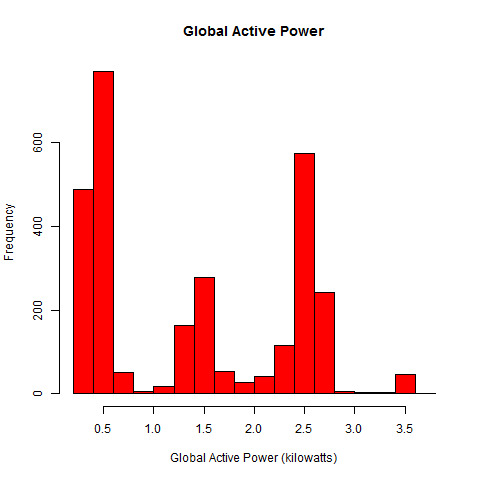
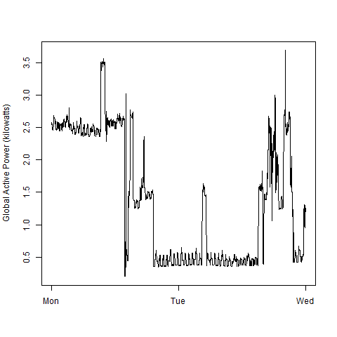
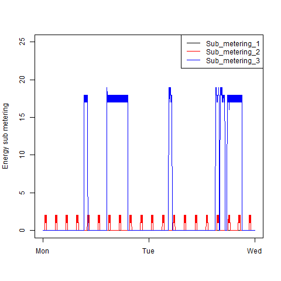
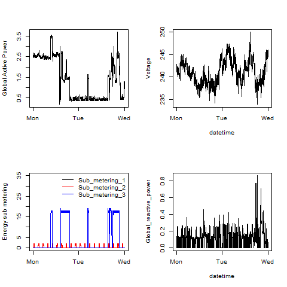

###Exploratory Data Analysis
# Course Project 1 README

Solution consists of:

- This readme file
- [Roger Peng's Readme and figures](peng_docs/README.md) 
- Script files in folder `scripts`.
	- [load_data.R](scripts/load_data.R) - contains function `load_data()`. This function creates the folder for sataset (it is directory `data` in the work directory), download dataset archive (file `data.zip`) and extract it. Then function exstract only data from the dates 2007-02-01 and 2007-02-02. It is a long process, so if folder created or archive downloaded and extracted, function may skip some steps. 
	- [plot1.R](scripts/plot1.R) -  contains function `plot1()` for first plot.
	- [plot2.R](scripts/plot1.R) -  contains function `plot2()` for second plot.
	- [plot3.R](scripts/plot1.R) -  contains function `plot3()` for third plot.
	- [plot4.R](scripts/plot1.R) -  contains function `plot4()` for fourth plot.
	- [main.R](scripts/main.R) -  main script, calls other scripts to draw plots.
- My figures in folder `scripts`.

##Example
```
> source("main.R")
Directory for data created.
Dataset arhive downloaded.
Dataset extracted.
Dataset loaded.
Draw plot 1.
Draw plot 2.
Draw plot 3.
Draw plot 4.
Done.
```
##Results
### Plot 1


 


### Plot 2

 


### Plot 3

  


### Plot 4

 
